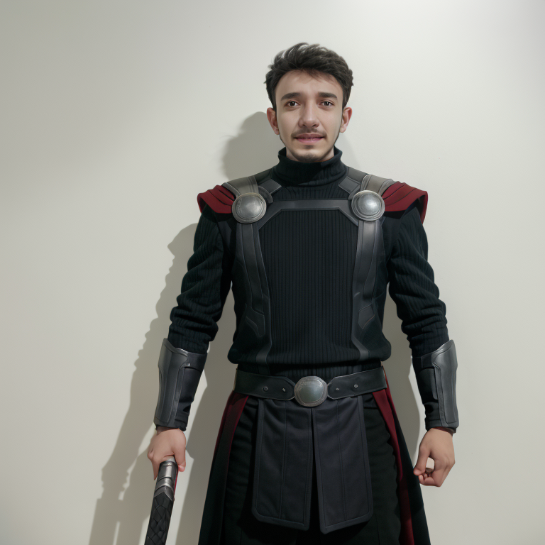

# tencent-ailab / IP-Adapter

This is an implementation of the [tencent-ailab / IP-Adapter](https://github.com/tencent-ailab/IP-Adapter) as a Cog model. [Cog packages machine learning models as standard containers.](https://github.com/replicate/cog)

First, download the pre-trained weights:

    cog run script/download-weights

Then, you can run predictions:

    cog predict -i ip_image=@ayush_512.jpg -i control_net_image=@output.1.png -i prompt="Thor: High Res, Confident demeanor, wielding Mjolnir, regal Asgardian attire." -i seed=15251

## Example:

"Thor: High Res, Confident demeanor, wielding Mjolnir, regal Asgardian attire."

